# lbyec72-ei2-p3-single_multidimensional_arrays-paolojoshuaa
lbyec72-ei2-p3-single_multidimensional_arrays-paolojoshuaa created by GitHub Classroom

# Menu
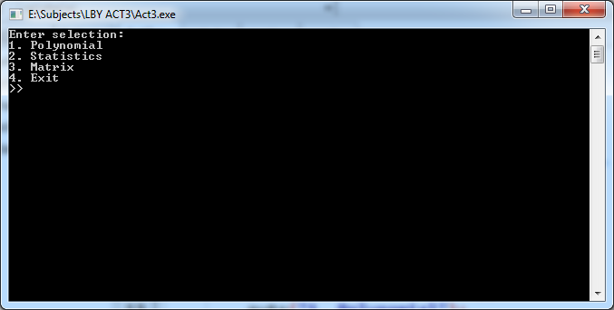

# Polynomial
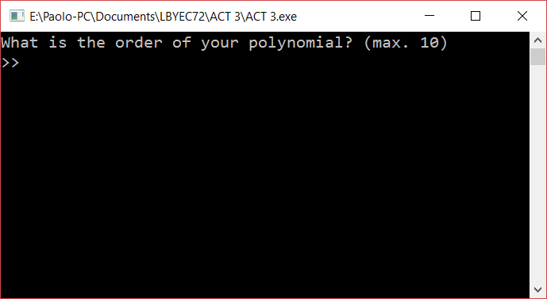
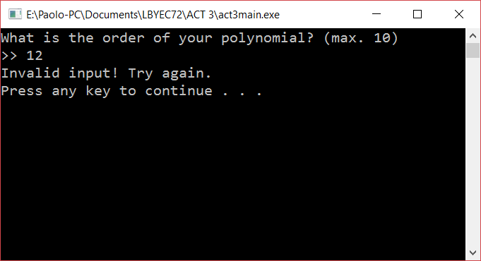
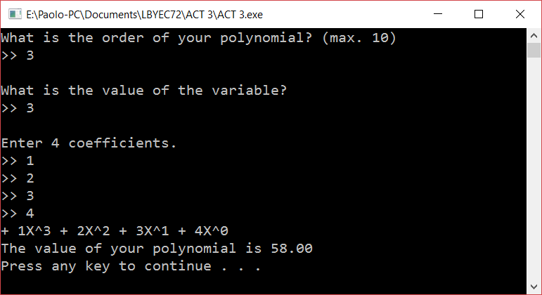
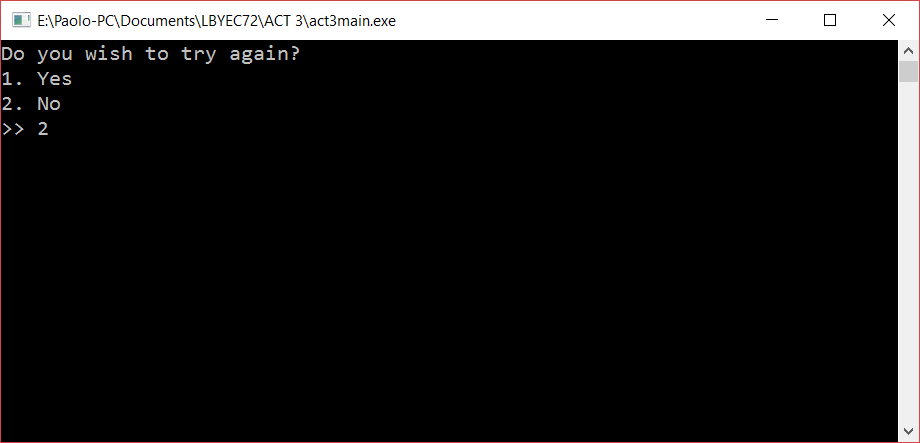

# Statistics
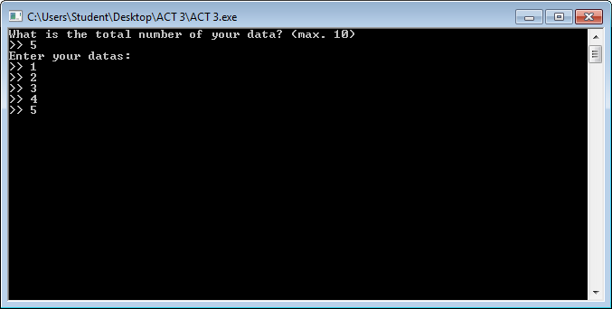
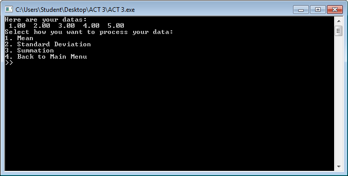

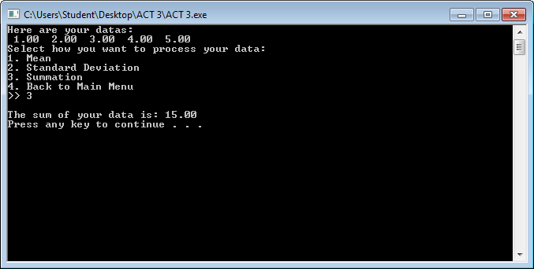

# Matrix
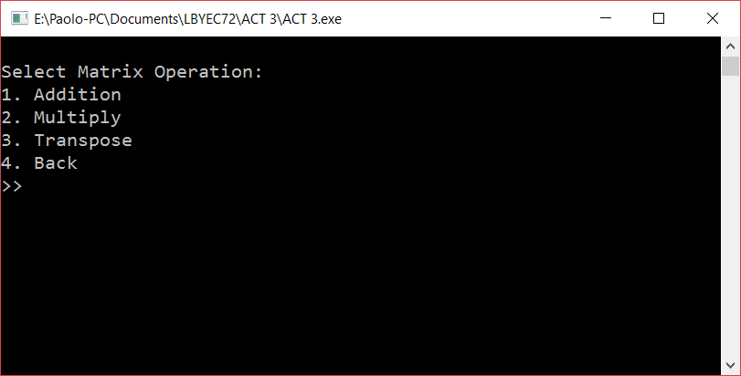
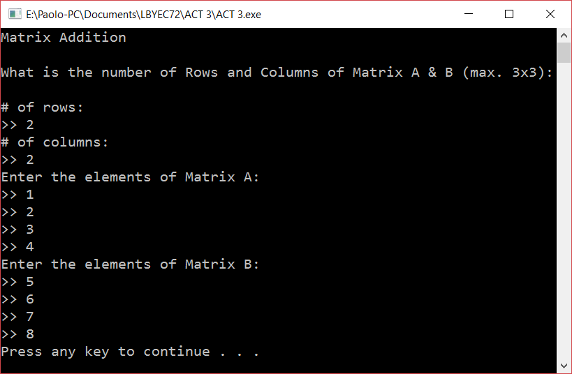
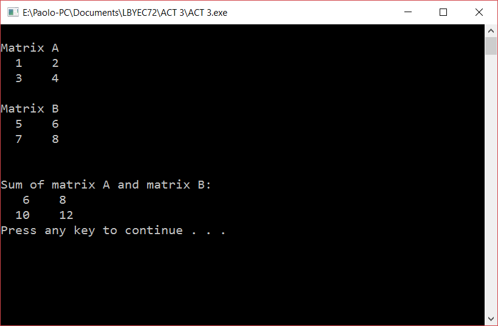
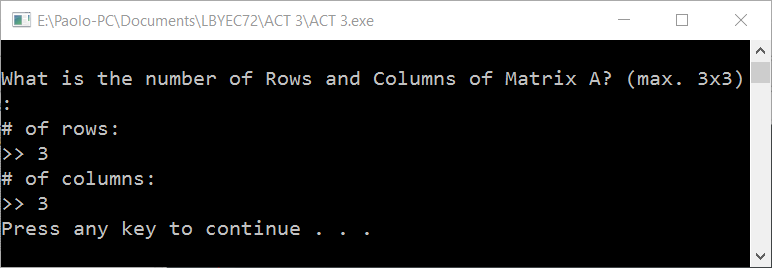
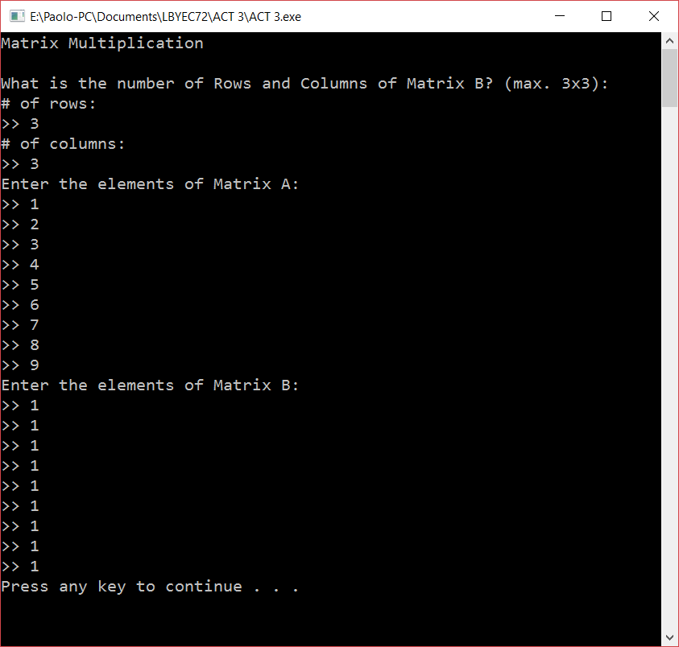
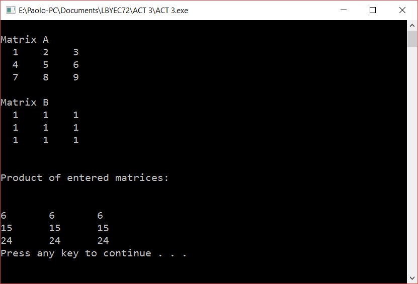
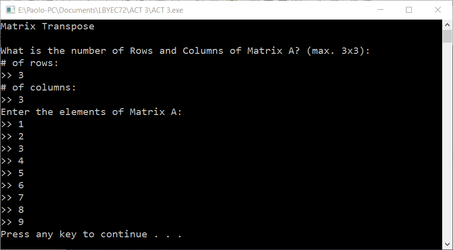
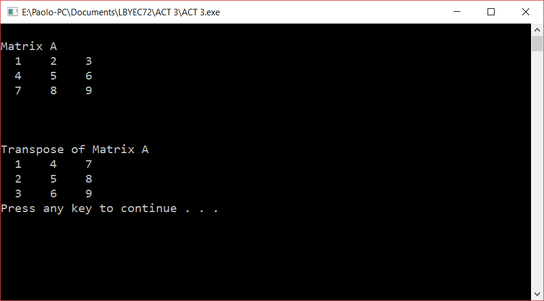

